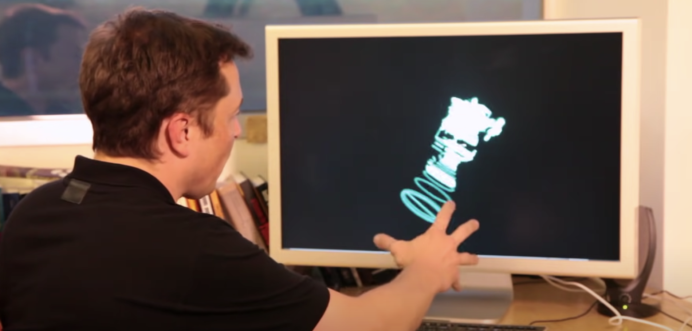

# hand-controls
한 번 만들어보고 싶었는데 시간이 없네

# 머스크형에게서 영감을 받다.

https://www.youtube.com/watch?v=xNqs_S-zEBY&ab_channel=SpaceX

이거 보고 아이언맨 떠올라서 급하게 따라 만들어본 3D 손 인터페이스. 멋있다. 역시 일론머스크.

# 그래서 내가 따라 만들었지.

생각해보니까 쉽게 만들 수 있더라고. 갓 구글 덕분에. 

https://developers.google.com/mediapipe/solutions/vision/hand_landmarker

이거 가져다 쓰면 됨.

# 생각해보니 내가 한게 없는데.

구글이 만든 기술을 용용한거밖에 더 되나. 내가 이럴려고 개발자를 하나 자괴감들어. 아 그냥 잠이나 잘까. 그럼 이 세상에 있는 모든 개발자들이 기존 기술 응용한거 밖에 없는데, 그분들의 실력이 엔지니어링 실력으로 평가받는건 아니잖아. 개발의 본질은 가치 창출이랬어. 
심지어 이 세상의 거의 대부분의 엔지니어들은 수학을 기반으로 하는데, 그분들은 과연 실력이 없는걸까? A-Z 까지 못한다고 그 사람 실력의 가치가 결정되는건 아니잖아. 그러니까 구글이 만든거 가져다 써도 괜찮아.

# 거인의 어깨위에 서.

뉴턴 형 이런 말 해줘서 고마워. 세상의 모든 지식은 서로 참조하면서 발전한다고 했던가. 무튼 형 덕분에 약간의 자괴감에서 빠져나올 수 있었어.

